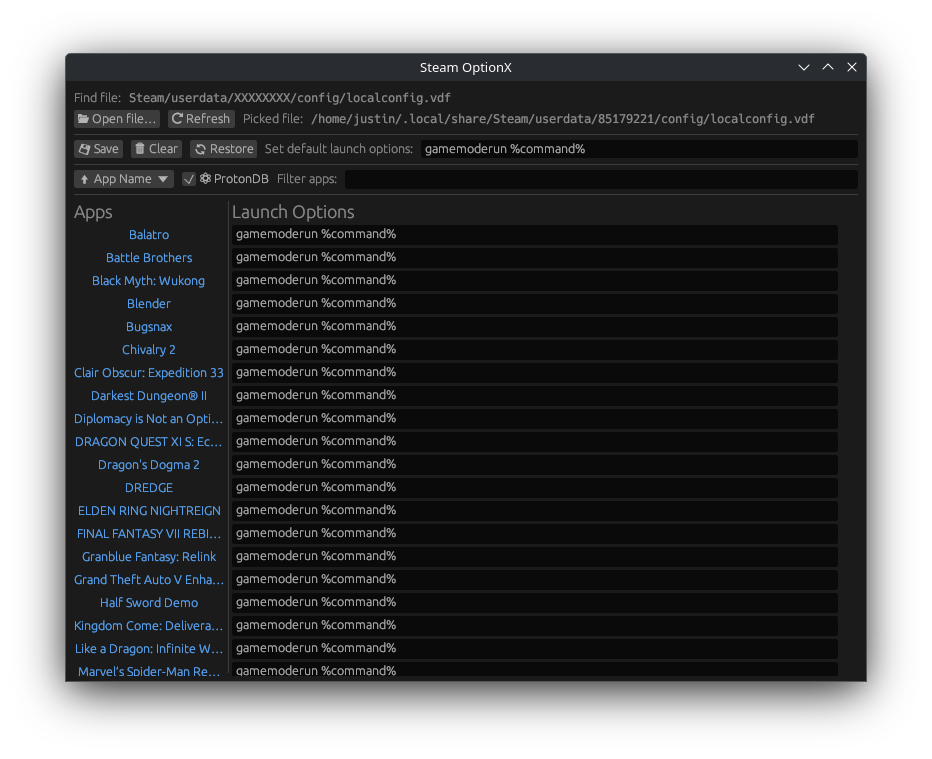

# Steam OptionX

## Description

An egui application to modify app launch options in Steam's config file.

Only takes publicly listed games from the Steam API for now.

Works on all platforms.



## Build

```sh
nix develop
cargo build --release
```

## Run

```sh
cargo run --release
```
